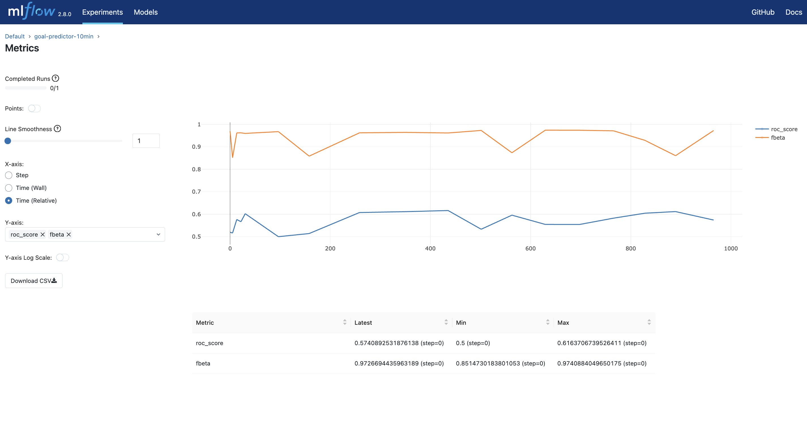

### Introduction
Can I predict if a goal will be scored in the next minute in a soccer match? The goal (no pun intended) of this project was to experiment a little with extremely imbalanced datatest. Something which comes across in multiple situations. To simulate a relevant dataset I decided to experiment with data from soccergames in the Euros 2020.

#### Design / setup of the project:
WIP

#### Starting date
Apr 1, 2022

#### Context
I expect it to be very hard to predict goals (if it were easy; wouldn't everybody have done it by now?) For now my aim is not to create a high scoring model. My goal is to check what strategy works best for this imbalanced dataset, while having some fun with soccer data. To create a relevant dataset I used some world cup data and created features which described what was happening per minute  in the game (e.g. where was the ball, which players were on the field, what kind of ball interactions happend?). With this data I tried to  predict if a goal would be scored in the next minute.

In addition I modelled three different datasets to see how they would impact the score:
> Aggregated all 1 min data prior to the prediciton point.
> Aggregate all 5 min data prior to the prediciton point.
> Aggregate all 10 min data prior to the prediction point.

###### Results
The results show that it usefull to experiment with different aggregated datasets as the aggregation on 10 level gives the best results for the roc-score and the fbeta-score.

    

When looking closely in the different models that were trained and tested and checking our evaluation metric for our imbalanced dataset we see the following results:

    

    

#### Tech and Tools
Jupyter, mlflow, imbalanced strategies, soccer data
