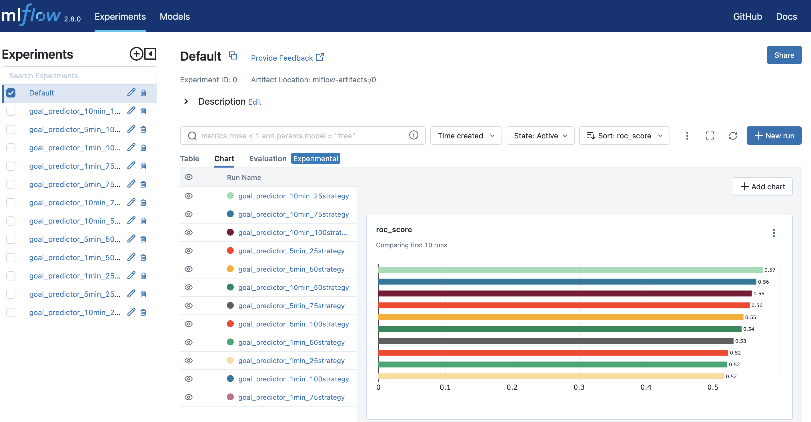
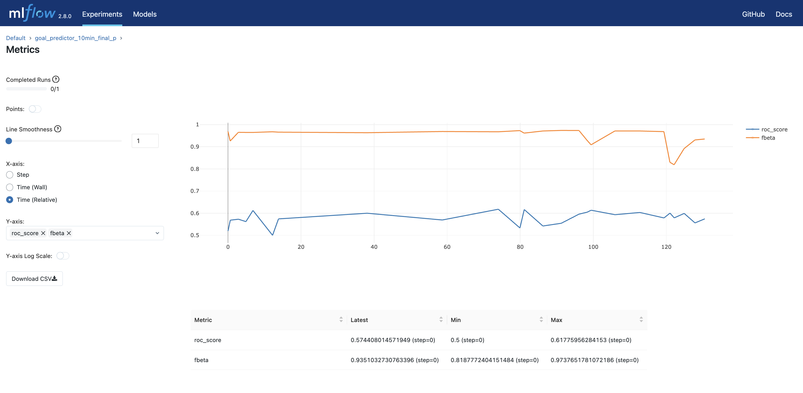
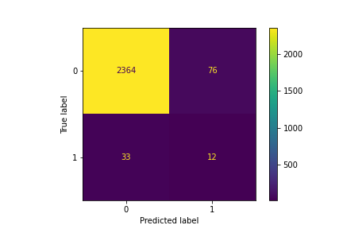
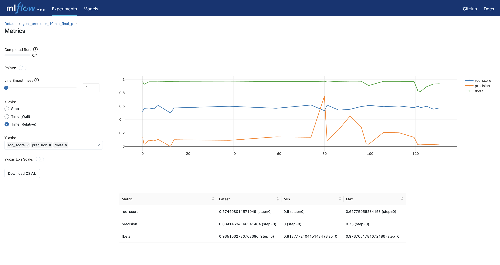
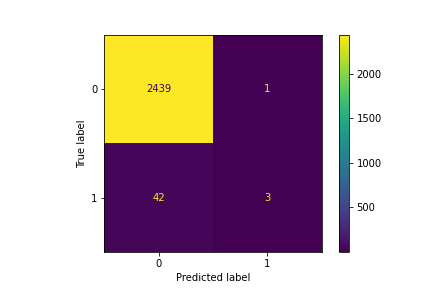

### Introduction
Can I predict if a goal will be scored in the next minute in a soccer match? The goal (no pun intended) of this project was to experiment a little with extremely imbalanced datatest. Something which comes across in multiple situations. To simulate a relevant dataset I decided to experiment with data from soccergames in the Euros 2020.

#### Starting date
Apr 1, 2022

#### Context
I expect it to be very hard to predict goals (if it were easy; wouldn't everybody have done it by now?) For now my aim is not to create a high scoring model. My goal is to check what strategy works best for this imbalanced dataset, while having some fun with soccer data. To create a relevant dataset I used some Euros 2020 data and created features which described what was happening per minute in the game (e.g. where was the ball, which players were on the field, what kind of ball interactions happend?). With this data I tried to predict if a goal would be scored in the next minute.

In addition I modelled three different datasets to see how they would impact the score:

**Datasets with aggregation on:**

* sum of 1 min data prior to the prediciton point.
* sum of 5 min data prior to the prediciton point.
* sum of 10 min data prior to the prediction point.

#### Results
The results show that it useful to experiment with different aggregated datasets as the aggregation on 10 level gives better resutls thatn the 1 and 5 min datasets:

    

Furthermore, when looking closely to the different models that were trained and tested and checking our evaluation metric for our imbalanced dataset, we can see that the SVC smoteENN (barely) comes out on top based on the  results from our roc-score and fbeta-score:

    

However, when looking closely to our confusion matrix, we can see that we still classify 76 moments incorrectly as postive cases.

    

It really depends on the usecase if this is the model that you would like to implement. Lets say that we want to place bets during a game and win some money. Then we really want to make sure that we only place bets when we are very certain. This way, we could potentially make some money. In this scenario, precision is most important. So running the evauation again, shows us that we can best use a RandomForest model with no sampling strategy (further analysis could use some hyperparameter tuning). Not a lot of positive predictions are made, but when it does so, this results in a scenario where 3 out of 4 predictions are correct!

The orange line shows a spike for precision especially for the random forest classification models:

    

In addition the confusion matrix shows the benefit of this precision:

    

This model could be used in follow-up matches in the world-cup to predict goals in the next minute.

#### Application
Combination of FastAPI backend and streamlit frontend.
Using a docker-compose file to run the full service.

#### Tech and Tools
Jupyter, mlflow, imbalanced strategies, FastApi, Streamlit, soccer data
